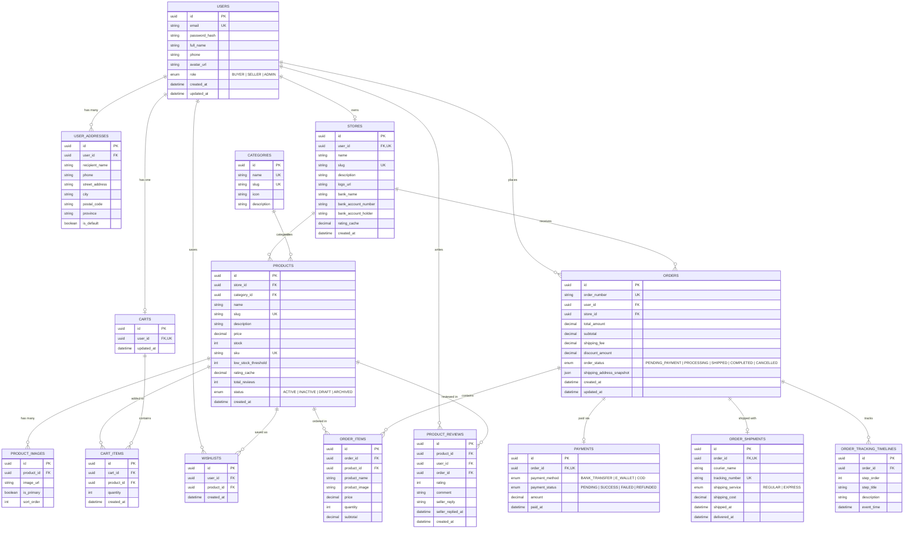

# 📐 Perencanaan Desain Database E-Commerce (PostgreSQL + Prisma ORM)

Dokumen ini adalah spesifikasi teknis lengkap desain database yang disusun berdasarkan kebutuhan visual, struktur data mock, dan alur halaman frontend pada folder `/frontend`. Dokumen ini dirancang dengan tingkat detail yang sangat tinggi dan instruksi eksplisit sehingga model AI yang lebih ringan/hemat biaya (seperti Gemini 1.5/2.0 Flash, Claude Haiku, GPT-4o-mini, atau DeepSeek) dapat mengimplementasikannya secara langsung tanpa ambiguitas.

---

## 1. Pemetaan Kebutuhan Frontend ke Entitas Database

Berdasarkan analisis menyeluruh terhadap source code di `/frontend` (`app/(shop)`, `app/(seller)`, `components`, dan `data/*`), berikut adalah pemetaan fitur & halaman ke entitas database:

| Fitur / Halaman Frontend                 | File Referensi UI                                                                         | Kebutuhan Data & Entitas Database Terkait                                                                                                   |
| :--------------------------------------- | :---------------------------------------------------------------------------------------- | :------------------------------------------------------------------------------------------------------------------------------------------ |
| **Autentikasi & Akun**                   | `(shop)/login/page.jsx`, `(shop)/register/page.jsx`                                       | Tabel `users` (email, password_hash, role, full_name).                                                                                      |
| **Profil Pengguna & Alamat**             | `(shop)/profile/page.jsx`, `(shop)/checkout/page.jsx`                                     | Tabel `users`, `user_addresses` (nama jalan, kota, kode pos, telepon, is_default).                                                          |
| **Toko & Pengaturan Seller**             | `(seller)/dashboard/settings/page.jsx`, `data/users.js`                                   | Tabel `stores` / `seller_profiles` (nama toko, deskripsi, info rekening bank, rating).                                                      |
| **Katalog & Kategori**                   | `(shop)/page.jsx`, `(shop)/products/page.jsx`                                             | Tabel `categories` (nama kategori, icon, slug).                                                                                             |
| **Katalog Produk & Detail**              | `(shop)/products/page.jsx`, `(shop)/products/[id]/page.jsx`, `data/products.js`           | Tabel `products` (nama, slug, deskripsi, harga, stok, SKU, rating), tabel `product_images` (galeri foto).                                   |
| **Keranjang Belanja**                    | `(shop)/cart/page.jsx`                                                                    | Tabel `carts`, `cart_items` (user_id, product_id, quantity).                                                                                |
| **Wishlist**                             | `(shop)/wishlist/page.jsx`                                                                | Tabel `wishlists` / `wishlist_items` (user_id, product_id).                                                                                 |
| **Checkout & Pembayaran**                | `(shop)/checkout/page.jsx`                                                                | Tabel `orders`, `order_items`, `payments` (metode bayar: Bank Transfer, E-Wallet, COD; pengiriman: Reguler, Express).                       |
| **Pesanan & Tracking**                   | `(shop)/orders/page.jsx`, `(shop)/orders/[id]/page.jsx`, `data/orders.js`                 | Tabel `orders`, `order_shipments` (kurir, nomor resi), `order_tracking_timelines` (8 tahapan tracking dari pesanan dibuat hingga terkirim). |
| **Manajemen Seller: Produk & Inventori** | `(seller)/dashboard/products/page.jsx`, `(seller)/dashboard/inventory/page.jsx`           | Relasi `stores` ke `products`, kolom `sku`, `stock`, `low_stock_threshold` (alert < 10).                                                    |
| **Manajemen Seller: Pesanan**            | `(seller)/dashboard/orders/page.jsx`                                                      | Filter status pesanan, update status pengiriman, input resi.                                                                                |
| **Ulasan & Balasan Seller**              | `(shop)/products/[id]/page.jsx`, `(seller)/dashboard/reviews/page.jsx`, `data/reviews.js` | Tabel `product_reviews` (rating 1-5, komentar pembeli, balasan penjual `seller_reply`).                                                     |
| **Promo & Beranda**                      | `(shop)/page.jsx`                                                                         | Tabel `banners` (slider promo) & `flash_sales` (opsional / pendukung).                                                                      |

---

## 2. Diagram Hubungan Entitas (ERD - Mermaid)



---

## 3. Spesifikasi Kamus Data (Data Dictionary)

### 3.1 Tabel `users`

Menyimpan identitas pengguna (baik pembeli, penjual, maupun admin sistem).

- Digunakan pada: `(shop)/login`, `(shop)/register`, `(shop)/profile`.

| Nama Kolom      | Tipe Data (PostgreSQL) | Tipe Prisma                   | Nullable | Default             | Keterangan & Aturan                |
| :-------------- | :--------------------- | :---------------------------- | :------- | :------------------ | :--------------------------------- |
| `id`            | `UUID`                 | `String @id @default(uuid())` | NO       | `gen_random_uuid()` | Primary key.                       |
| `email`         | `VARCHAR(255)`         | `String @unique`              | NO       | -                   | Email unik untuk login.            |
| `password_hash` | `VARCHAR(255)`         | `String`                      | NO       | -                   | Hash kata sandi (bcrypt/argon2).   |
| `full_name`     | `VARCHAR(100)`         | `String`                      | NO       | -                   | Nama lengkap user.                 |
| `phone`         | `VARCHAR(20)`          | `String?`                     | YES      | `NULL`              | Nomor kontak handphone / WhatsApp. |
| `avatar_url`    | `VARCHAR(500)`         | `String?`                     | YES      | `NULL`              | Foto profil user.                  |
| `role`          | `enum_user_role`       | `UserRole`                    | NO       | `'BUYER'`           | Nilai: `BUYER`, `SELLER`, `ADMIN`. |
| `created_at`    | `TIMESTAMP(3)`         | `DateTime @default(now())`    | NO       | `CURRENT_TIMESTAMP` | Waktu daftar akun.                 |
| `updated_at`    | `TIMESTAMP(3)`         | `DateTime @updatedAt`         | NO       | `CURRENT_TIMESTAMP` | Waktu pembaruan profil terakhir.   |

---

### 3.2 Tabel `user_addresses`

Menyimpan alamat pengiriman pembeli.

- Digunakan pada: `(shop)/checkout`, `(shop)/profile`.

| Nama Kolom       | Tipe Data      | Tipe Prisma                   | Nullable | Default             | Keterangan & Aturan                           |
| :--------------- | :------------- | :---------------------------- | :------- | :------------------ | :-------------------------------------------- |
| `id`             | `UUID`         | `String @id @default(uuid())` | NO       | `gen_random_uuid()` | Primary key.                                  |
| `user_id`        | `UUID`         | `String`                      | NO       | -                   | FK ke `users(id)` dengan `onDelete: Cascade`. |
| `recipient_name` | `VARCHAR(100)` | `String`                      | NO       | -                   | Nama penerima paket.                          |
| `phone`          | `VARCHAR(20)`  | `String`                      | NO       | -                   | Nomor HP penerima.                            |
| `street_address` | `TEXT`         | `String`                      | NO       | -                   | Alamat lengkap (cth: "123 Main St").          |
| `city`           | `VARCHAR(100)` | `String`                      | NO       | -                   | Kota/Kabupaten (cth: "Jakarta").              |
| `postal_code`    | `VARCHAR(10)`  | `String`                      | NO       | -                   | Kode pos (cth: "12345").                      |
| `province`       | `VARCHAR(100)` | `String?`                     | YES      | `NULL`              | Provinsi.                                     |
| `is_default`     | `BOOLEAN`      | `Boolean`                     | NO       | `false`             | Menandai alamat pengiriman utama.             |
| `created_at`     | `TIMESTAMP(3)` | `DateTime @default(now())`    | NO       | `CURRENT_TIMESTAMP` | Waktu dibuat.                                 |

---

### 3.3 Tabel `stores`

Profil toko penjual. Setiap penjual memiliki satu toko aktif.

- Digunakan pada: `(seller)/dashboard/settings`, `data/users.js` (sellers array).

| Nama Kolom            | Tipe Data      | Tipe Prisma                   | Nullable | Default             | Keterangan & Aturan                      |
| :-------------------- | :------------- | :---------------------------- | :------- | :------------------ | :--------------------------------------- |
| `id`                  | `UUID`         | `String @id @default(uuid())` | NO       | `gen_random_uuid()` | Primary key.                             |
| `user_id`             | `UUID`         | `String @unique`              | NO       | -                   | FK ke `users(id)` (1 user = 1 store).    |
| `name`                | `VARCHAR(100)` | `String`                      | NO       | -                   | Nama toko (cth: "My Awesome Store").     |
| `slug`                | `VARCHAR(120)` | `String @unique`              | NO       | -                   | Slug URL toko (cth: "my-awesome-store"). |
| `description`         | `TEXT`         | `String?`                     | YES      | `NULL`              | Deskripsi toko ("Best gadgets in town"). |
| `logo_url`            | `VARCHAR(500)` | `String?`                     | YES      | `NULL`              | Logo avatar toko.                        |
| `bank_name`           | `VARCHAR(50)`  | `String?`                     | YES      | `NULL`              | Nama bank (cth: "BCA").                  |
| `bank_account_number` | `VARCHAR(50)`  | `String?`                     | YES      | `NULL`              | Nomor rekening toko ("1234567890").      |
| `bank_account_holder` | `VARCHAR(100)` | `String?`                     | YES      | `NULL`              | Nama pemilik rekening.                   |
| `rating_cache`        | `DECIMAL(3,2)` | `Decimal`                     | NO       | `0.00`              | Rata-rata rating toko (cth: 4.8).        |
| `created_at`          | `TIMESTAMP(3)` | `DateTime @default(now())`    | NO       | `CURRENT_TIMESTAMP` | Waktu toko terdaftar (`joined`).         |
| `updated_at`          | `TIMESTAMP(3)` | `DateTime @updatedAt`         | NO       | `CURRENT_TIMESTAMP` | Waktu update toko.                       |

---

### 3.4 Tabel `categories`

Kategori produk e-commerce.

- Digunakan pada: `(shop)/page.jsx`, `(shop)/products/page.jsx`, `data/products.js`.

| Nama Kolom    | Tipe Data     | Tipe Prisma                   | Nullable | Default             | Keterangan & Aturan                                        |
| :------------ | :------------ | :---------------------------- | :------- | :------------------ | :--------------------------------------------------------- |
| `id`          | `UUID`        | `String @id @default(uuid())` | NO       | `gen_random_uuid()` | Primary key.                                               |
| `name`        | `VARCHAR(50)` | `String @unique`              | NO       | -                   | Nama kategori: `Electronics`, `Fashion`, `Home`, `Beauty`. |
| `slug`        | `VARCHAR(60)` | `String @unique`              | NO       | -                   | Cth: `electronics`, `fashion`, `home`, `beauty`.           |
| `icon`        | `VARCHAR(50)` | `String?`                     | YES      | `NULL`              | Icon emoji (💻, 👗, 🏠, 💄) atau URL icon.                 |
| `description` | `TEXT`        | `String?`                     | YES      | `NULL`              | Penjelasan singkat kategori.                               |

---

### 3.5 Tabel `products`

Katalog barang dagangan yang dijual oleh toko.

- Digunakan pada: `(shop)/products`, `(shop)/products/[id]`, `(seller)/dashboard/products`, `(seller)/dashboard/inventory`.

| Nama Kolom            | Tipe Data             | Tipe Prisma                   | Nullable | Default             | Keterangan & Aturan                               |
| :-------------------- | :-------------------- | :---------------------------- | :------- | :------------------ | :------------------------------------------------ |
| `id`                  | `UUID`                | `String @id @default(uuid())` | NO       | `gen_random_uuid()` | Primary key.                                      |
| `store_id`            | `UUID`                | `String`                      | NO       | -                   | FK ke `stores(id)`.                               |
| `category_id`         | `UUID`                | `String`                      | NO       | -                   | FK ke `categories(id)`.                           |
| `name`                | `VARCHAR(200)`        | `String`                      | NO       | -                   | Nama produk ("Product 1").                        |
| `slug`                | `VARCHAR(250)`        | `String @unique`              | NO       | -                   | URL slug produk.                                  |
| `description`         | `TEXT`                | `String`                      | NO       | -                   | Deskripsi detail spesifikasi produk.              |
| `price`               | `DECIMAL(12,2)`       | `Decimal`                     | NO       | -                   | Harga satuan (misal IDR 50.000 s/d 1.000.000).    |
| `stock`               | `INTEGER`             | `Int`                         | NO       | `0`                 | Jumlah stok tersisa.                              |
| `sku`                 | `VARCHAR(50)`         | `String? @unique`             | YES      | `NULL`              | Kode identifikasi produk (`SKU-001`).             |
| `low_stock_threshold` | `INTEGER`             | `Int`                         | NO       | `10`                | Batas minimal untuk alert stok menipis (< 10).    |
| `rating_cache`        | `DECIMAL(2,1)`        | `Decimal`                     | NO       | `0.0`               | Rating akumulasi (1.0 - 5.0).                     |
| `total_reviews`       | `INTEGER`             | `Int`                         | NO       | `0`                 | Jumlah review terdaftar.                          |
| `status`              | `enum_product_status` | `ProductStatus`               | NO       | `'ACTIVE'`          | Nilai: `ACTIVE`, `INACTIVE`, `DRAFT`, `ARCHIVED`. |
| `created_at`          | `TIMESTAMP(3)`        | `DateTime @default(now())`    | NO       | `CURRENT_TIMESTAMP` | Waktu rilis produk.                               |
| `updated_at`          | `TIMESTAMP(3)`        | `DateTime @updatedAt`         | NO       | `CURRENT_TIMESTAMP` | Waktu update.                                     |

---

### 3.6 Tabel `product_images`

Menyimpan multi-gambar galeri foto produk.

- Digunakan pada: `(shop)/products/[id]` (gambar utama 600x600 & thumbnail galeri 100x100).

| Nama Kolom   | Tipe Data      | Tipe Prisma                   | Nullable | Default             | Keterangan & Aturan                              |
| :----------- | :------------- | :---------------------------- | :------- | :------------------ | :----------------------------------------------- |
| `id`         | `UUID`         | `String @id @default(uuid())` | NO       | `gen_random_uuid()` | Primary key.                                     |
| `product_id` | `UUID`         | `String`                      | NO       | -                   | FK ke `products(id)` dengan `onDelete: Cascade`. |
| `image_url`  | `VARCHAR(500)` | `String`                      | NO       | -                   | URL foto produk (`https://picsum.photos/...`).   |
| `is_primary` | `BOOLEAN`      | `Boolean`                     | NO       | `false`             | True jika dijadikan foto cover utama.            |
| `sort_order` | `INTEGER`      | `Int`                         | NO       | `0`                 | Urutan tampilan galeri foto (0, 1, 2, dst).      |

---

### 3.7 Tabel `carts` & `cart_items`

Menyimpan keranjang belanja sementara user.

- Digunakan pada: `(shop)/cart`.

#### `carts`

| Nama Kolom   | Tipe Data      | Tipe Prisma                   | Nullable | Default             | Keterangan & Aturan                  |
| :----------- | :------------- | :---------------------------- | :------- | :------------------ | :----------------------------------- |
| `id`         | `UUID`         | `String @id @default(uuid())` | NO       | `gen_random_uuid()` | Primary key.                         |
| `user_id`    | `UUID`         | `String @unique`              | NO       | -                   | FK ke `users(id)` (1 cart per user). |
| `created_at` | `TIMESTAMP(3)` | `DateTime @default(now())`    | NO       | `CURRENT_TIMESTAMP` | Tanggal keranjang dibuat.            |
| `updated_at` | `TIMESTAMP(3)` | `DateTime @updatedAt`         | NO       | `CURRENT_TIMESTAMP` | Tanggal update terakhir.             |

#### `cart_items`

| Nama Kolom   | Tipe Data      | Tipe Prisma                   | Nullable | Default             | Keterangan & Aturan                           |
| :----------- | :------------- | :---------------------------- | :------- | :------------------ | :-------------------------------------------- |
| `id`         | `UUID`         | `String @id @default(uuid())` | NO       | `gen_random_uuid()` | Primary key.                                  |
| `cart_id`    | `UUID`         | `String`                      | NO       | -                   | FK ke `carts(id)` dengan `onDelete: Cascade`. |
| `product_id` | `UUID`         | `String`                      | NO       | -                   | FK ke `products(id)`.                         |
| `quantity`   | `INTEGER`      | `Int`                         | NO       | `1`                 | Kuantitas item dibeli (min 1).                |
| `created_at` | `TIMESTAMP(3)` | `DateTime @default(now())`    | NO       | `CURRENT_TIMESTAMP` | Waktu item dimasukkan.                        |

---

### 3.8 Tabel `wishlists`

Daftar produk favorit/disimpan oleh pembeli.

- Digunakan pada: `(shop)/wishlist`.

| Nama Kolom   | Tipe Data      | Tipe Prisma                   | Nullable | Default             | Keterangan & Aturan   |
| :----------- | :------------- | :---------------------------- | :------- | :------------------ | :-------------------- |
| `id`         | `UUID`         | `String @id @default(uuid())` | NO       | `gen_random_uuid()` | Primary key.          |
| `user_id`    | `UUID`         | `String`                      | NO       | -                   | FK ke `users(id)`.    |
| `product_id` | `UUID`         | `String`                      | NO       | -                   | FK ke `products(id)`. |
| `created_at` | `TIMESTAMP(3)` | `DateTime @default(now())`    | NO       | `CURRENT_TIMESTAMP` | Waktu disimpan.       |

> **Constraint Unik:** `@@unique([user_id, product_id])` — Seorang user tidak boleh menyimpan produk yang sama berulang kali.

---

### 3.9 Tabel `orders` & `order_items`

Pesanan pembelian barang, ringkasan biaya, dan status transaksi.

- Digunakan pada: `(shop)/checkout`, `(shop)/orders`, `(seller)/dashboard/orders`, `(seller)/dashboard/overview`.

#### `orders`

| Nama Kolom                  | Tipe Data           | Tipe Prisma                   | Nullable | Default             | Keterangan & Aturan                                                                          |
| :-------------------------- | :------------------ | :---------------------------- | :------- | :------------------ | :------------------------------------------------------------------------------------------- |
| `id`                        | `UUID`              | `String @id @default(uuid())` | NO       | `gen_random_uuid()` | Primary key.                                                                                 |
| `order_number`              | `VARCHAR(50)`       | `String @unique`              | NO       | -                   | Nomor pesanan terbaca (cth: `ORD-1001`).                                                     |
| `user_id`                   | `UUID`              | `String`                      | NO       | -                   | FK ke `users(id)` (pembeli).                                                                 |
| `store_id`                  | `UUID`              | `String`                      | NO       | -                   | FK ke `stores(id)` (toko penjual).                                                           |
| `subtotal`                  | `DECIMAL(12,2)`     | `Decimal`                     | NO       | -                   | Total harga barang (cth: $500,000 / Rp 500.000).                                             |
| `shipping_fee`              | `DECIMAL(12,2)`     | `Decimal`                     | NO       | `0.00`              | Ongkir (Reguler: 15.000, Express: 30.000).                                                   |
| `discount_amount`           | `DECIMAL(12,2)`     | `Decimal`                     | NO       | `0.00`              | Diskon promo jika ada (cth: 50.000).                                                         |
| `total_amount`              | `DECIMAL(12,2)`     | `Decimal`                     | NO       | -                   | `subtotal + shipping_fee - discount_amount`.                                                 |
| `order_status`              | `enum_order_status` | `OrderStatus`                 | NO       | `'PENDING_PAYMENT'` | `PENDING_PAYMENT`, `PROCESSING`, `SHIPPED`, `COMPLETED`, `CANCELLED`.                        |
| `shipping_address_snapshot` | `JSONB`             | `Json`                        | NO       | -                   | Salinan data alamat lengkap saat checkout (mencegah perubahan jika user edit alamat profil). |
| `created_at`                | `TIMESTAMP(3)`      | `DateTime @default(now())`    | NO       | `CURRENT_TIMESTAMP` | Tanggal pemesanan.                                                                           |
| `updated_at`                | `TIMESTAMP(3)`      | `DateTime @updatedAt`         | NO       | `CURRENT_TIMESTAMP` | Tanggal update status.                                                                       |

#### `order_items`

| Nama Kolom      | Tipe Data       | Tipe Prisma                   | Nullable | Default             | Keterangan & Aturan                              |
| :-------------- | :-------------- | :---------------------------- | :------- | :------------------ | :----------------------------------------------- |
| `id`            | `UUID`          | `String @id @default(uuid())` | NO       | `gen_random_uuid()` | Primary key.                                     |
| `order_id`      | `UUID`          | `String`                      | NO       | -                   | FK ke `orders(id)` dengan `onDelete: Cascade`.   |
| `product_id`    | `UUID`          | `String?`                     | YES      | `NULL`              | FK ke `products(id)` dengan `onDelete: SetNull`. |
| `product_name`  | `VARCHAR(200)`  | `String`                      | NO       | -                   | Snapshot nama produk saat dibeli.                |
| `product_image` | `VARCHAR(500)`  | `String?`                     | YES      | `NULL`              | Snapshot URL gambar produk.                      |
| `price`         | `DECIMAL(12,2)` | `Decimal`                     | NO       | -                   | Snapshot harga produk per unit saat transaksi.   |
| `quantity`      | `INTEGER`       | `Int`                         | NO       | -                   | Jumlah unit produk yang dibeli.                  |
| `subtotal`      | `DECIMAL(12,2)` | `Decimal`                     | NO       | -                   | `price * quantity`.                              |

---

### 3.10 Tabel `payments`

Data transaksi pembayaran untuk tiap pesanan.

- Digunakan pada: `(shop)/checkout`, `(shop)/orders`.

| Nama Kolom       | Tipe Data             | Tipe Prisma                   | Nullable | Default             | Keterangan & Aturan                         |
| :--------------- | :-------------------- | :---------------------------- | :------- | :------------------ | :------------------------------------------ |
| `id`             | `UUID`                | `String @id @default(uuid())` | NO       | `gen_random_uuid()` | Primary key.                                |
| `order_id`       | `UUID`                | `String @unique`              | NO       | -                   | FK ke `orders(id)`.                         |
| `payment_method` | `enum_payment_method` | `PaymentMethod`               | NO       | -                   | `BANK_TRANSFER`, `E_WALLET`, `COD`.         |
| `payment_status` | `enum_payment_status` | `PaymentStatus`               | NO       | `'PENDING'`         | `PENDING`, `SUCCESS`, `FAILED`, `REFUNDED`. |
| `amount`         | `DECIMAL(12,2)`       | `Decimal`                     | NO       | -                   | Nilai pembayaran yang ditagihkan.           |
| `paid_at`        | `TIMESTAMP(3)`        | `DateTime?`                   | YES      | `NULL`              | Waktu pembayaran terverifikasi.             |
| `created_at`     | `TIMESTAMP(3)`        | `DateTime @default(now())`    | NO       | `CURRENT_TIMESTAMP` | Waktu dibuat.                               |

---

### 3.11 Tabel `order_shipments` & `order_tracking_timelines`

Menyimpan nomor resi, kurir, dan riwayat langkah tracking step-by-step.

- Digunakan pada: `(shop)/orders/[id]/page.jsx`, `(seller)/dashboard/orders`.

#### `order_shipments`

| Nama Kolom         | Tipe Data               | Tipe Prisma                   | Nullable | Default             | Keterangan & Aturan                            |
| :----------------- | :---------------------- | :---------------------------- | :------- | :------------------ | :--------------------------------------------- |
| `id`               | `UUID`                  | `String @id @default(uuid())` | NO       | `gen_random_uuid()` | Primary key.                                   |
| `order_id`         | `UUID`                  | `String @unique`              | NO       | -                   | FK ke `orders(id)` (1 pengiriman per pesanan). |
| `courier_name`     | `VARCHAR(50)`           | `String`                      | NO       | -                   | Nama kurir (cth: `JNE Express`).               |
| `tracking_number`  | `VARCHAR(100)`          | `String? @unique`             | YES      | `NULL`              | Nomor resi pengiriman (`REG123456780`).        |
| `shipping_service` | `enum_shipping_service` | `ShippingService`             | NO       | `'REGULAR'`         | `REGULAR` (3-5 hari), `EXPRESS` (1-2 hari).    |
| `shipping_cost`    | `DECIMAL(12,2)`         | `Decimal`                     | NO       | -                   | Ongkir yang berlaku.                           |
| `shipped_at`       | `TIMESTAMP(3)`          | `DateTime?`                   | YES      | `NULL`              | Waktu diserahkan ke kurir.                     |
| `delivered_at`     | `TIMESTAMP(3)`          | `DateTime?`                   | YES      | `NULL`              | Waktu paket sampai ke pembeli.                 |

#### `order_tracking_timelines`

Menyimpan riwayat 8 timeline visual sesuai `(shop)/orders/[id]/page.jsx`:

1. `Order Placed` (Pesanan Dibuat)
2. `Confirmed` (Dikonfirmasi Penjual)
3. `Packed` (Dikemas)
4. `Shipped` (Diserahkan ke Kurir)
5. `In Transit` (Dalam Perjalanan)
6. `Arrived` (Tiba di Kota Tujuan)
7. `Out for Delivery` (Sedang Diantar)
8. `Delivered` (Selesai)

| Nama Kolom    | Tipe Data      | Tipe Prisma                   | Nullable | Default             | Keterangan & Aturan                             |
| :------------ | :------------- | :---------------------------- | :------- | :------------------ | :---------------------------------------------- |
| `id`          | `UUID`         | `String @id @default(uuid())` | NO       | `gen_random_uuid()` | Primary key.                                    |
| `order_id`    | `UUID`         | `String`                      | NO       | -                   | FK ke `orders(id)` dengan `onDelete: Cascade`.  |
| `step_order`  | `INTEGER`      | `Int`                         | NO       | -                   | Urutan langkah (1 s/d 8).                       |
| `step_title`  | `VARCHAR(100)` | `String`                      | NO       | -                   | Judul langkah (cth: "Order Placed", "Shipped"). |
| `description` | `TEXT`         | `String?`                     | YES      | `NULL`              | Keterangan detail lokasi/status.                |
| `event_time`  | `TIMESTAMP(3)` | `DateTime`                    | NO       | `CURRENT_TIMESTAMP` | Waktu terjadinya step tracking.                 |

---

### 3.12 Tabel `product_reviews`

Menyimpan testimoni dan ulasan pembeli beserta fitur balasan dari seller.

- Digunakan pada: `(shop)/products/[id]`, `(seller)/dashboard/reviews`, `data/reviews.js`.

| Nama Kolom          | Tipe Data      | Tipe Prisma                   | Nullable | Default             | Keterangan & Aturan                                |
| :------------------ | :------------- | :---------------------------- | :------- | :------------------ | :------------------------------------------------- |
| `id`                | `UUID`         | `String @id @default(uuid())` | NO       | `gen_random_uuid()` | Primary key.                                       |
| `product_id`        | `UUID`         | `String`                      | NO       | -                   | FK ke `products(id)`.                              |
| `user_id`           | `UUID`         | `String`                      | NO       | -                   | FK ke `users(id)` (pembeli pemberi review).        |
| `order_id`          | `UUID`         | `String?`                     | YES      | `NULL`              | FK ke `orders(id)` untuk verifikasi pembelian.     |
| `rating`            | `INTEGER`      | `Int`                         | NO       | `5`                 | Nilai rating 1 sampai 5 bintang.                   |
| `comment`           | `TEXT`         | `String`                      | NO       | -                   | Isi testimoni / review ("Great quality product!"). |
| `seller_reply`      | `TEXT`         | `String?`                     | YES      | `NULL`              | Balasan dari penjual di dashboard.                 |
| `seller_replied_at` | `TIMESTAMP(3)` | `DateTime?`                   | YES      | `NULL`              | Waktu balasan dikirim oleh penjual.                |
| `created_at`        | `TIMESTAMP(3)` | `DateTime @default(now())`    | NO       | `CURRENT_TIMESTAMP` | Waktu ulasan dibuat.                               |
| `updated_at`        | `TIMESTAMP(3)` | `DateTime @updatedAt`         | NO       | `CURRENT_TIMESTAMP` | Waktu perubahan ulasan.                            |

---

### 3.13 Tabel Tambahan: `banners` & `flash_sales` (Mendukung Home UI)

Tabel ini menjamin komponen banner promo dan flash sale di `(shop)/page.jsx` dapat dikelola secara dinamis:

- **`banners`**: `id`, `title`, `image_url`, `link_url`, `is_active`, `sort_order`, `created_at`.
- **`flash_sales`**: `id`, `product_id`, `discount_price`, `start_time`, `end_time`, `is_active`.

---

## 4. Skema Lengkap Prisma (`schema.prisma`)

Berikut adalah file skema Prisma production-ready yang siap disalin ke `backend/prisma/schema.prisma`:

```prisma
// File: backend/prisma/schema.prisma

generator client {
  provider = "prisma-client-js"
}

datasource db {
  provider = "postgresql"
  url      = env("DATABASE_URL")
}

// ----------------------------------------------------
// ENUMS
// ----------------------------------------------------

enum UserRole {
  BUYER
  SELLER
  ADMIN
}

enum ProductStatus {
  ACTIVE
  INACTIVE
  DRAFT
  ARCHIVED
}

enum OrderStatus {
  PENDING_PAYMENT
  PROCESSING
  SHIPPED
  COMPLETED
  CANCELLED
}

enum PaymentMethod {
  BANK_TRANSFER
  E_WALLET
  COD
}

enum PaymentStatus {
  PENDING
  SUCCESS
  FAILED
  REFUNDED
}

enum ShippingService {
  REGULAR
  EXPRESS
}

// ----------------------------------------------------
// MODELS
// ----------------------------------------------------

model User {
  id           String        @id @default(uuid())
  email        String        @unique
  passwordHash String        @map("password_hash")
  fullName     String        @map("full_name")
  phone        String?
  avatarUrl    String?       @map("avatar_url")
  role         UserRole      @default(BUYER)
  createdAt    DateTime      @default(now()) @map("created_at")
  updatedAt    DateTime      @updatedAt @map("updated_at")

  addresses    UserAddress[]
  store        Store?
  cart         Cart?
  wishlists    Wishlist[]
  orders       Order[]
  reviews      ProductReview[]

  @@map("users")
}

model UserAddress {
  id            String   @id @default(uuid())
  userId        String   @map("user_id")
  recipientName String   @map("recipient_name")
  phone         String
  streetAddress String   @map("street_address")
  city          String
  postalCode    String   @map("postal_code")
  province      String?
  isDefault     Boolean  @default(false) @map("is_default")
  createdAt     DateTime @default(now()) @map("created_at")

  user          User     @relation(fields: [userId], references: [id], onDelete: Cascade)

  @@index([userId])
  @@map("user_addresses")
}

model Store {
  id                String    @id @default(uuid())
  userId            String    @unique @map("user_id")
  name              String
  slug              String    @unique
  description       String?
  logoUrl           String?   @map("logo_url")
  bankName          String?   @map("bank_name")
  bankAccountNumber String?   @map("bank_account_number")
  bankAccountHolder String?   @map("bank_account_holder")
  ratingCache       Decimal   @default(0.0) @db.Decimal(3, 2) @map("rating_cache")
  createdAt         DateTime  @default(now()) @map("created_at")
  updatedAt         DateTime  @updatedAt @map("updated_at")

  user              User      @relation(fields: [userId], references: [id], onDelete: Cascade)
  products          Product[]
  orders            Order[]

  @@map("stores")
}

model Category {
  id          String    @id @default(uuid())
  name        String    @unique
  slug        String    @unique
  icon        String?
  description String?

  products    Product[]

  @@map("categories")
}

model Product {
  id                 String         @id @default(uuid())
  storeId            String         @map("store_id")
  categoryId         String         @map("category_id")
  name               String
  slug               String         @unique
  description        String         @db.Text
  price              Decimal        @db.Decimal(12, 2)
  stock              Int            @default(0)
  sku                String?        @unique
  lowStockThreshold  Int            @default(10) @map("low_stock_threshold")
  ratingCache        Decimal        @default(0.0) @db.Decimal(2, 1) @map("rating_cache")
  totalReviews       Int            @default(0) @map("total_reviews")
  status             ProductStatus  @default(ACTIVE)
  createdAt          DateTime       @default(now()) @map("created_at")
  updatedAt          DateTime       @updatedAt @map("updated_at")

  store              Store          @relation(fields: [storeId], references: [id], onDelete: Cascade)
  category           Category       @relation(fields: [categoryId], references: [id], onDelete: Restrict)
  images             ProductImage[]
  cartItems          CartItem[]
  wishlists          Wishlist[]
  orderItems         OrderItem[]
  reviews            ProductReview[]
  flashSales         FlashSale[]

  @@index([storeId])
  @@index([categoryId])
  @@index([status])
  @@map("products")
}

model ProductImage {
  id        String   @id @default(uuid())
  productId String   @map("product_id")
  imageUrl  String   @map("image_url")
  isPrimary Boolean  @default(false) @map("is_primary")
  sortOrder Int      @default(0) @map("sort_order")

  product   Product  @relation(fields: [productId], references: [id], onDelete: Cascade)

  @@index([productId])
  @@map("product_images")
}

model Cart {
  id        String     @id @default(uuid())
  userId    String     @unique @map("user_id")
  createdAt DateTime   @default(now()) @map("created_at")
  updatedAt DateTime   @updatedAt @map("updated_at")

  user      User       @relation(fields: [userId], references: [id], onDelete: Cascade)
  items     CartItem[]

  @@map("carts")
}

model CartItem {
  id        String   @id @default(uuid())
  cartId    String   @map("cart_id")
  productId String   @map("product_id")
  quantity  Int      @default(1)
  createdAt DateTime @default(now()) @map("created_at")

  cart      Cart     @relation(fields: [cartId], references: [id], onDelete: Cascade)
  product   Product  @relation(fields: [productId], references: [id], onDelete: Cascade)

  @@unique([cartId, productId])
  @@map("cart_items")
}

model Wishlist {
  id        String   @id @default(uuid())
  userId    String   @map("user_id")
  productId String   @map("product_id")
  createdAt DateTime @default(now()) @map("created_at")

  user      User     @relation(fields: [userId], references: [id], onDelete: Cascade)
  product   Product  @relation(fields: [productId], references: [id], onDelete: Cascade)

  @@unique([userId, productId])
  @@map("wishlists")
}

model Order {
  id                       String                  @id @default(uuid())
  orderNumber              String                  @unique @map("order_number")
  userId                   String                  @map("user_id")
  storeId                  String                  @map("store_id")
  subtotal                 Decimal                 @db.Decimal(12, 2)
  shippingFee              Decimal                 @default(0.00) @db.Decimal(12, 2) @map("shipping_fee")
  discountAmount           Decimal                 @default(0.00) @db.Decimal(12, 2) @map("discount_amount")
  totalAmount              Decimal                 @db.Decimal(12, 2) @map("total_amount")
  orderStatus              OrderStatus             @default(PENDING_PAYMENT) @map("order_status")
  shippingAddressSnapshot  Json                    @map("shipping_address_snapshot")
  createdAt                DateTime                @default(now()) @map("created_at")
  updatedAt                DateTime                @updatedAt @map("updated_at")

  user                     User                    @relation(fields: [userId], references: [id], onDelete: Restrict)
  store                    Store                   @relation(fields: [storeId], references: [id], onDelete: Restrict)
  items                    OrderItem[]
  payment                  Payment?
  shipment                 OrderShipment?
  trackingTimelines        OrderTrackingTimeline[]
  reviews                  ProductReview[]

  @@index([userId])
  @@index([storeId])
  @@index([orderStatus])
  @@map("orders")
}

model OrderItem {
  id           String   @id @default(uuid())
  orderId      String   @map("order_id")
  productId    String?  @map("product_id")
  productName  String   @map("product_name")
  productImage String?  @map("product_image")
  price        Decimal  @db.Decimal(12, 2)
  quantity     Int
  subtotal     Decimal  @db.Decimal(12, 2)

  order        Order    @relation(fields: [orderId], references: [id], onDelete: Cascade)
  product      Product? @relation(fields: [productId], references: [id], onDelete: SetNull)

  @@index([orderId])
  @@map("order_items")
}

model Payment {
  id            String        @id @default(uuid())
  orderId       String        @unique @map("order_id")
  paymentMethod PaymentMethod @map("payment_method")
  paymentStatus PaymentStatus @default(PENDING) @map("payment_status")
  amount        Decimal       @db.Decimal(12, 2)
  paidAt        DateTime?     @map("paid_at")
  createdAt     DateTime      @default(now()) @map("created_at")

  order         Order         @relation(fields: [orderId], references: [id], onDelete: Cascade)

  @@map("payments")
}

model OrderShipment {
  id              String          @id @default(uuid())
  orderId         String          @unique @map("order_id")
  courierName     String          @map("courier_name")
  trackingNumber  String?         @unique @map("tracking_number")
  shippingService ShippingService @default(REGULAR) @map("shipping_service")
  shippingCost    Decimal         @db.Decimal(12, 2) @map("shipping_cost")
  shippedAt       DateTime?       @map("shipped_at")
  deliveredAt     DateTime?       @map("delivered_at")

  order           Order           @relation(fields: [orderId], references: [id], onDelete: Cascade)

  @@map("order_shipments")
}

model OrderTrackingTimeline {
  id          String   @id @default(uuid())
  orderId     String   @map("order_id")
  stepOrder   Int      @map("step_order")
  stepTitle   String   @map("step_title")
  description String?
  eventTime   DateTime @default(now()) @map("event_time")

  order       Order    @relation(fields: [orderId], references: [id], onDelete: Cascade)

  @@index([orderId, stepOrder])
  @@map("order_tracking_timelines")
}

model ProductReview {
  id              String    @id @default(uuid())
  productId       String    @map("product_id")
  userId          String    @map("user_id")
  orderId         String?   @map("order_id")
  rating          Int       @default(5)
  comment         String    @db.Text
  sellerReply     String?   @db.Text @map("seller_reply")
  sellerRepliedAt DateTime? @map("seller_replied_at")
  createdAt       DateTime  @default(now()) @map("created_at")
  updatedAt       DateTime  @updatedAt @map("updated_at")

  product         Product   @relation(fields: [productId], references: [id], onDelete: Cascade)
  user            User      @relation(fields: [userId], references: [id], onDelete: Cascade)
  order           Order?    @relation(fields: [orderId], references: [id], onDelete: SetNull)

  @@index([productId])
  @@index([userId])
  @@map("product_reviews")
}

model Banner {
  id        String   @id @default(uuid())
  title     String
  imageUrl  String   @map("image_url")
  linkUrl   String?  @map("link_url")
  isActive  Boolean  @default(true) @map("is_active")
  sortOrder Int      @default(0) @map("sort_order")
  createdAt DateTime @default(now()) @map("created_at")

  @@map("banners")
}

model FlashSale {
  id            String   @id @default(uuid())
  productId     String   @map("product_id")
  discountPrice Decimal  @db.Decimal(12, 2) @map("discount_price")
  startTime     DateTime @map("start_time")
  endTime       DateTime @map("end_time")
  isActive      Boolean  @default(true) @map("is_active")

  product       Product  @relation(fields: [productId], references: [id], onDelete: Cascade)

  @@index([productId])
  @@map("flash_sales")
}
```

---

## 5. Strategi Indexing & Optimasi Query

Untuk menjaga performa query backend tetap kencang:

1. **Pencarian Produk & Filter Katalog** (`(shop)/products`):
   - Index pada `products(category_id)`, `products(store_id)`, dan `products(status)`.
   - Index B-Tree pada `products(price)` untuk sorting _Low to High_ dan _High to Low_.
2. **Dashboard Seller Query**:
   - Index pada `orders(store_id, order_status)` untuk query agregat statistik penjualan, chart recharts, dan pesanan terbaru.
3. **Tracking Pesanan Realtime**:
   - Index komposit pada `order_tracking_timelines(order_id, step_order)` untuk memastikan query timeline berurutan dan cepat.
4. **Keamanan Keranjang & Wishlist**:
   - Constraint unik `@@unique([cartId, productId])` dan `@@unique([userId, productId])` mencegah duplikasi record saat tombol ditekan berkali-kali.

---

## 6. Pemetaan Seed Data (Dummy Data Sync)

Agar backend langsung menyatu mulus dengan UI frontend saat pertama kali dijalankan, buat file seeder (`prisma/seed.ts`) berdasarkan data mock yang ada di `/frontend/data/`:

### A. Kategori (`frontend/app/(shop)/page.jsx`)

```json
[
  { "name": "Electronics", "slug": "electronics", "icon": "💻" },
  { "name": "Fashion", "slug": "fashion", "icon": "👗" },
  { "name": "Home", "slug": "home", "icon": "🏠" },
  { "name": "Beauty", "slug": "beauty", "icon": "💄" }
]
```

### B. Pengguna & Penjual (`frontend/data/users.js`)

- Buat 2 user buyer (`john@example.com`, `jane@example.com`).
- Buat 2 toko seller (`Tech Store` rating 4.8, `Fashion Hub` rating 4.5) yang terhubung ke user dengan role `SELLER`.

### C. Produk (`frontend/data/products.js`)

- Generate 30 produk (id 1 s/d 30).
- Hubungkan secara rotasi ke 4 kategori.
- Buat foto cover `https://picsum.photos/seed/{id}/400/400` dan tambahkan 3 gambar galeri di `product_images` dengan link `https://picsum.photos/seed/p{id}-{i}/100/100`.
- Isi SKU unik dengan format `SKU-00{id}` dan stok acak (0 s/d 100).

### D. Pesanan & Tracking Timeline (`frontend/data/orders.js`)

- Generate 15 pesanan (`ORD-1000` s/d `ORD-1014`) dengan variasi status: `Pending`, `Processing`, `Shipped`, `Completed`, `Cancelled`.
- Sertakan shipment kurir `JNE Express` dan resi `REG12345678{i}`.
- Masukkan 8 langkah timeline tracking untuk tiap order yang statusnya `Shipped` atau `Completed`.

### E. Ulasan Produk (`frontend/data/reviews.js`)

- Tambahkan 10 review dengan rating 4-5 bintang, komentar `"Great product, highly recommend!"`, dan beberapa balasan seller.

---

## 7. Instruksi Implementasi untuk AI Model Murah (Prompt Template)

Gunakan prompt berikut saat menginstruksikan model AI yang lebih murah (seperti Gemini Flash atau Claude Haiku) untuk mengimplementasikan backend:

> ### 📋 Prompt Siap Pakai untuk Model Murah:
>
> ```markdown
> Halo, tolong bantu saya mengimplementasikan database dan seeder backend berdasarkan spesifikasi teknis di "database_design.md".
>
> Langkah yang harus kamu lakukan:
>
> 1. Salin Prisma Schema dari Bab 4 di "database_design.md" ke file "backend/prisma/schema.prisma".
> 2. Buat script seeder di "backend/prisma/seed.ts" yang mengimpor data persis seperti dijelaskan di Bab 6 (30 produk, 4 kategori, 2 seller, 2 user, 15 pesanan beserta 8 timeline tracking, dan 10 reviews).
> 3. Konfigurasikan "backend/package.json" agar memiliki script "prisma:seed": "tsx prisma/seed.ts".
> 4. Pastikan semua relasi database, tipe data DECIMAL untuk harga, serta penamaan snake_case pada kolom database (@map) sudah terpasang rapi.
> ```

---

## 8. Ringkasan & Checklist Validasi

- [x] Mendukung semua halaman pembeli: Home, Catalog, Detail Produk, Cart, Wishlist, Checkout, Tracking Pesanan, Profil, Login/Register.
- [x] Mendukung semua dashboard seller: Overview & Analytics (Recharts), Manajemen Produk, Kelola Pesanan & Resi, Inventori & Alert Stok (< 10), Ulasan & Balas Review, Pengaturan Rekening & Profil Toko.
- [x] Snapshot harga dan alamat saat transaksi untuk menjaga konsistensi finansial/audit.
- [x] Skema Prisma 100% kompatibel dengan PostgreSQL.
- [x] Siap dieksekusi oleh model AI ekonomis dengan instruksi yang terstandarisasi.
